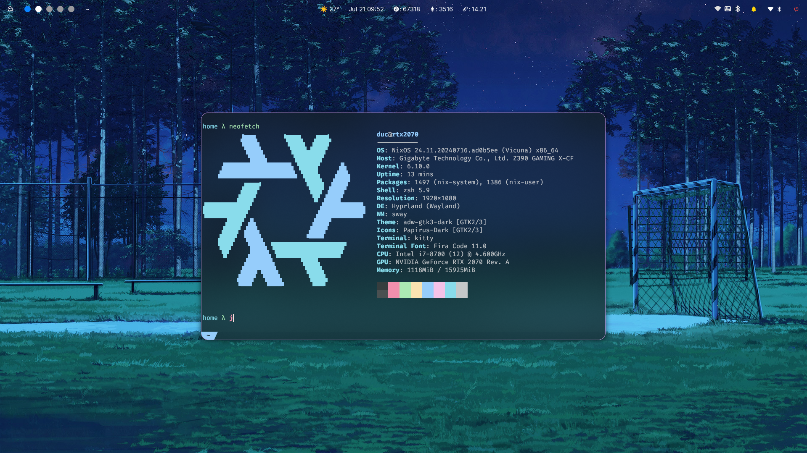

<!-- markdownlint-disable MD041 MD033 MD013 -->

<div align="center">
<a href="#">
  
</a>
</div>

## :package: Repository Contents

- **[Flake](./flake):** configurations for code formatting, and pre-commit hooks.
- **[Home](./home):** [Home-Manager](https://github.com/nix-community/home-manager) configurations.
- **[Hosts](./hosts):** Configurations specific to individual hosts.
- **[Lib](./lib):** Personal library and utilities.
- **[Modules](./modules):** Shared system-wide modules.
- **[pkgs](./pkgs):** Customized and additional packages.

## :hammer: Install

After boot to Nix installation.

### [Optional] Connect wifi

```bash
sudo su
```

```bash
systemctl start wpa_supplicant
wpa_cli
```

```bash
scan
add_network
set_network 0 ssid "wifi-name"
set_network 0 psk "wifi-password"
enable_network 0
save_config
reconnect
```

Then `CTRL-D` to exit.

### Clone repo

```bash
nix-shell -p git
git clone https://ducnguyen96/gorgeos
```

### Disk partioning and mounting

- Modify [disko-config](./misc/disko/disko-config.nix) as you want. Full guide [here](https://github.com/nix-community/disko/blob/master/docs/quickstart.md)
- Run

  ```bash
  ./gorgeos/misc/disko/run
  ```

### Customize host and home

#### Host

```bash
mv gorgeos /mnt
cd /mnt/gorgeos
```

Then generate your hardware config

```bash
nixos-generate-config --root /mnt
```

Copy the hardware config to your host

```bash
cp /mnt/etc/nixos/hardware-configuration.nix hosts/rtx2070
```

### `nixos-install`

After updating host and home as you like you can install the whole thing with

`rtx2070` here is your host

```bash
nixos-install --flake .#rtx2070
```

It will take a while. Then after that you can reboot.

## Daily usages

### Rebuild

```bash
# note that rebuild script assume your flake is in the same directory as this repo which is $HOME/gorgeos
rebuild
```

### Delete system old generations

```bash
sudo nix-collect-garbage -d
```

### Delete home old generations

```bash
nix-collect-garbage -d
```

## Waydroid

### Init

Source: <https://docs.waydro.id/faq/using-custom-waydroid-images>
Noted: You can click on `Problem Downloading button to choose other mirror`

### Usage

Start the container

```bash
# Start the WayDroid LXC container
sudo systemctl start waydroid-container

# You'll know it worked by checking the journal You should see "Started Waydroid Container".
sudo journalctl -u waydroid-container

# Start WayDroid session
# You'll know it is finished when you see the message "Android with user 0 is ready".
waydroid session start
```

General usage

```bash
# Start Android UI
waydroid show-full-ui

# List Android apps
waydroid app list

# Start an Android app
waydroid app launch <application name>

# Install an Android app
waydroid app install </path/to/app.apk>

# Enter the LXC shell
sudo waydroid shell

# Overrides the full-ui width
waydroid prop set persist.waydroid.width 608
```
