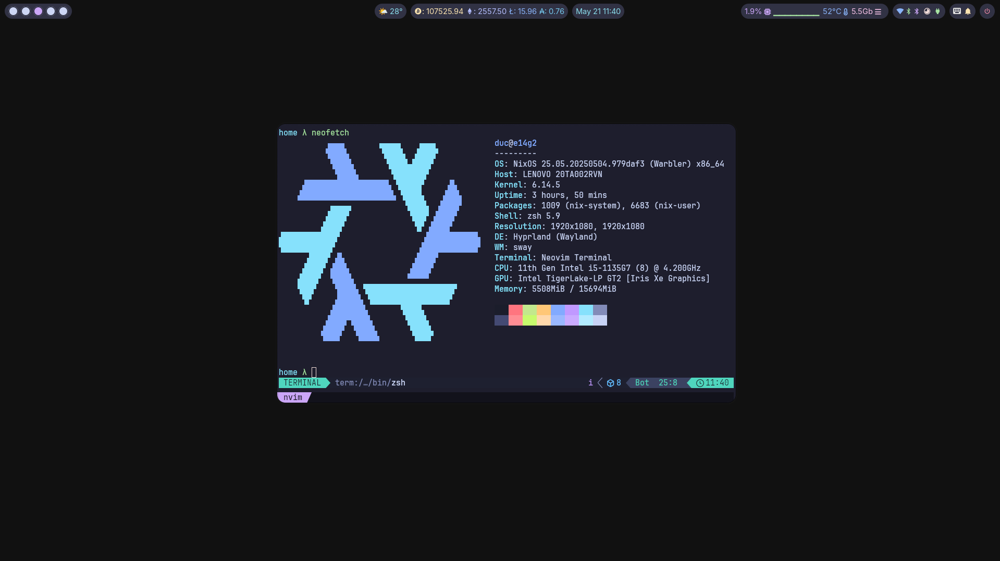

<!-- markdownlint-disable MD041 MD033 MD013 -->

## Demo

## :package: Repository Contents

- **[Flake](./flake):** configurations for code formatting, and pre-commit hooks.
- **[Home](./home):** [Home-Manager](https://github.com/nix-community/home-manager) configurations.
- **[Hosts](./hosts):** Configurations specific to individual hosts.
- **[Lib](./lib):** Personal library and utilities.
- **[pkgs](./pkgs):** Customized and additional packages.

## Rescure Grub

After booting using boot usb:

- Mount your `root` and `boot` partition to `/mnt` and `/mnt/boot`
- `nixos-enter --root /mnt`
- `NIXOS_INSTALL_BOOTLOADER=1 /nix/var/nix/profiles/system/bin/switch-to-configuration boot`
